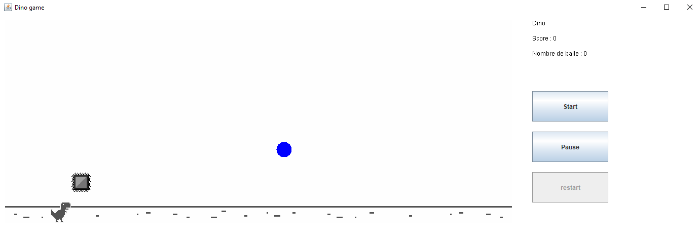

# 🦖 Dino Runner - Java Swing Game

Dino Runner est un jeu de type endless runner développé avec **Java Swing**, inspiré du célèbre "Dino Game" de Google Chrome. Ce projet met en avant mes compétences en **programmation Java**, **conception d'interface utilisateur** et **implémentation de mécaniques de jeu**.

## 🎮 Fonctionnalités
- Contrôle du T-Rex avec la touche **Haut** pour sauter 🦘.
- Contrôle du T-Rex avec la touche **Espace** pour Tirer.
- Évitez les obstacles pour atteindre le meilleur score possible 📈.
- Ajout d'un mode tir d'obstacle avec des projectiles.
- Gameplay fluide et dynamique ⚡.

## 📸 Aperçu

## 📝 Licence
Ce projet est sous licence **MIT**. Voir le fichier [LICENSE](LICENSE) pour plus d’informations.

---

Si vous aimez ce projet, n'hésitez pas à ⭐ sur GitHub ! 😊
